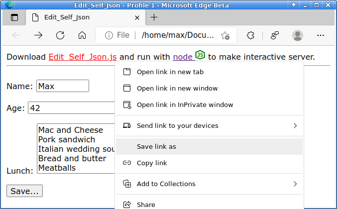
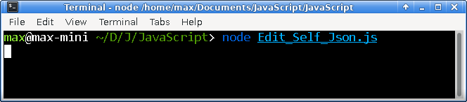

# Edit_Self_Json
An HTML program that can modify itself - a quine.

This html file stands alone and carries with it, it's own NodeJS server component.  It's a self-contained portable client-and-server coupling that allows the client html to edit itself.  It has it's own segment - a json object that it uses to store it's own data client-side.  Then the server allows the client html file to edit itself and reload the page.  This file can operate out of the file:// uri - using nodejs on localhost.

To get this to work, you can download the html client (Edit_Self_Json.html) file.  Open it, then download the Edit_Self_Json.js file, run it with NodeJS.  Then the html client will now become active and be allowed to change itself on-the-fly.

This file can be sent to a phone or tablet and run in "read-only" mode, but then should the mobile user want to change it, they need only send that same file to their pc and open it in "read-write" mode.

That is still very useful for the phone user.  The client-side app may provide a very rich app that is read-only.  Such as a viewable, printable, editable invoice.  Or anything else you might want to send someone with a bit of data pre-loaded.  You could send someone a barcode label that's editable with the NodeJS component.

Shows downloading the .js (NodeJS) file embedded in the html file as a data-uri downloadable JavaScript file.

Running that NodeJS file makes the above html client come alive!

